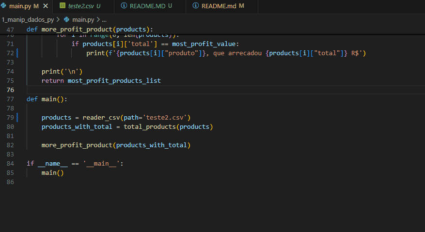

# Questão 1 - Manipulação de Dados em Python

## Instrução

(Curso de Formação Python: Prioridade Alta)  
Escreva um programa em Python que receba um arquivo CSV contendo informações de 
vendas (colunas: "produto", "quantidade", "preço"). O programa deve:  

• Ler os dados do arquivo.  
• Calcular o total arrecadado para cada produto.  
• Exibir o produto com maior valor arrecadado.  

## Requisitos

- Python 3.x instalado

## Como usar

1 - Prepare um arquivo csv com as seguintes colunas

    - produto: Nome do produto.
    - quantidade: Quantidade de produtos vendidos.
    - preco: Preço unitário de cada produto.

2 - Modifique o caminho passado na função main para a função "reader_csv" para o caminho do arquivo desejado

3 - Rode o programa:

```
python main.py
```

# Exemplo:



