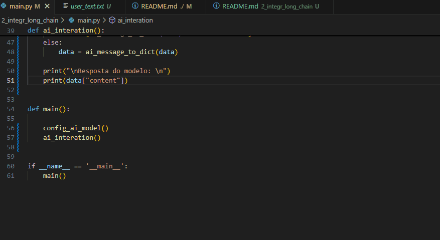

# Questão 2 - Integração com langchain

## Instrução

(Curso de LangChain: Prioridade Alta)  
Utilizando a biblioteca LangChain, crie uma aplicação simples que:  

• Configure um modelo de linguagem para responder a perguntas sobre um texto 
fornecido pelo usuário.  
• Receba como entrada um texto qualquer digitado pelo usuário.  
• Permita ao usuário fazer perguntas sobre o texto e exiba as respostas geradas pelo 
modelo.  

Obs.: Documente as etapas necessárias para configurar o ambiente e instalar as 
dependências. 

## Requisitos

- Python 3.x instalado
- Bibliotecas Python:
    - dotenv: Para carregar variáveis de ambiente a partir de um arquivo .env
    - langchain_openai: Para interagir com a API do modelo de linguagem.

## Passos para configurar o ambiente

1 - Instalar as dependências necessárias

Na raiz do projeto rode

```
pip install -r requirements.txt
```

2 - Criar o arquivo .env na raiz do repositório

O programa utiliza a variável de ambiente TOGETHER_API_KEY para configurar o acesso à API da Together. Para isso, crie um arquivo .env na raiz do seu projeto e insira sua chave de API:

```
TOGETHER_API_KEY=SuaChaveAPIaqui
```

## Como usar

1 - Preparação do arquivo texto:
    O arquivo user_txt.txt contém o texto que o modelo usará como base para responder as perguntas, modifique como desejar

2 - Executando o programa:

- Abra um terminal nessa pasta

```
python main.py
```
- Digite a pergunta que desejar no terminal

## Exemplo




