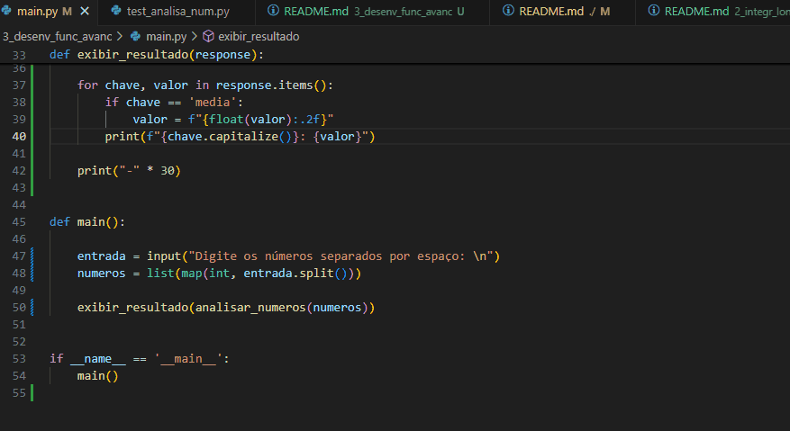

# Questão 3 - Desenvolvimento de Funções Avançadas 

## Instrução

(Curso Python 3: Prioridade Baixa) 
Crie uma função Python chamada analisar_numeros() que receba uma lista de números 
como argumento. A função deve retornar: 

• A média dos números. 
• O maior e o menor número da lista. 
• Quantos números são pares.

Inclua testes para validar a função com diferentes entradas. 

## Requisitos

- Python 3.x instalado
- Bibliotecas Python:
    - pytest: Realização dos testes solicitados

## Configuração do ambiente

Para instalar as dependências necessárias, rode na raiz do projeto:

```bash
pip install -r requirements.txt
```

## Como usar

Nesta pasta, execute o seguinte comando:

```bash
python main.py
```

Em seguida digite a lista de números que deseja fazer a analise, separando os números por espaço

## Testes

Foi utilizada a biblioteca pytest para realização de testes parametrizados, para roda-los basta rodar o comando no bash:

```bash
pytest
```

## Exemplo



