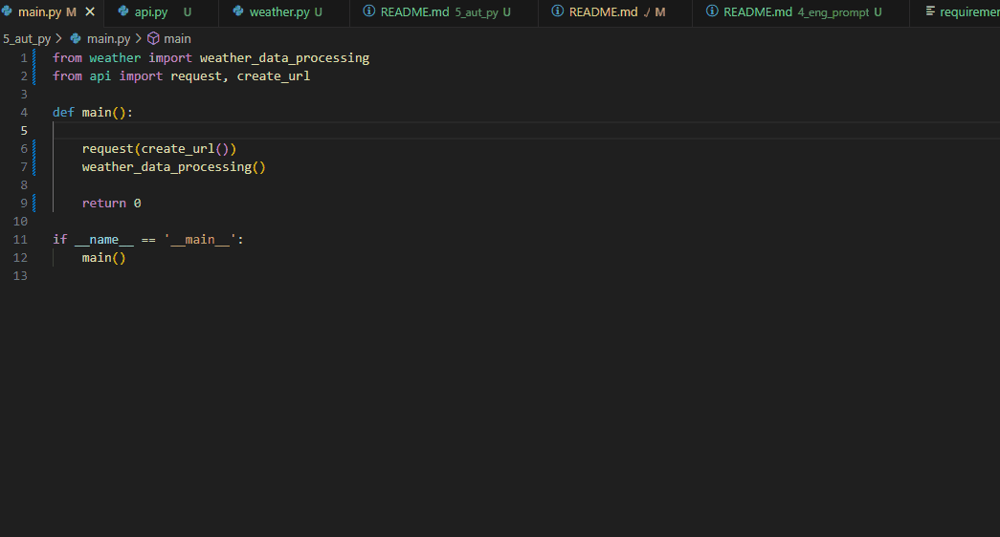

# Questão 5 - Automação com Python 

## Instrução

(Curso Formação Python: Prioridade Alta)  
Escreva um script que automatize o seguinte cenário: 

• Acesse uma API pública (por exemplo, de previsão do tempo ou cotação de 
moedas).  
• Busque informações relevantes.  
• Salve os dados obtidos em um arquivo JSON.  
• Exiba um resumo das informações no console. 

## Funcionalidades

- Acesso à API MeteoBlue: O script faz uma solicitação GET à API da **MeteoBlue** para obter dados meteorológicos sobre uma previsão do tempo.
- Processamento dos Dados: Calcula informações importantes como a temperatura média, máxima e mínima, velocidade do vento média, precipitação, índice UV, umidade relativa, e chances de neve.
- Exibição de Relatório: O script exibe um relatório detalhado com as informações coletadas e calculadas de forma organizada no console.
- Armazenamento em JSON: Todos os dados obtidos da API são salvos em um arquivo JSON (`response_data.json`).

## Divisão

O código dessa questão está dividido em 3 módulos:

- main.py: controla a execução
- api.py: configura, faz as requisições e salva os dados da api
- weather.py: manipula os dados para gerar o relatório

## Requisitos

- Python 3.x instalado
-*Bibliotecas Python:
  - dotenv: Para carregar variáveis de ambiente de um arquivo `.env`.
  - requests: Para fazer solicitações HTTP à API da MeteoBlue.
  - json: Para trabalhar com dados no formato JSON.
  - datetime: Para manipulação e formatação de datas.

## Configuração do ambiente

1 - Instalar as dependências

```bash
pip install -r requirements.txt
```

2 - Criar/adicionar no arquivo .env na raiz do repositório:

```
METEO_BLUE_API_KEY=SuaChaveAPIaqui
```

## Execução

- Nesta pasta, execute o script:

```bash
python main.py
```

- Serã feita uma requisição na api da meteo blue, os dados são de previsão do tempo.
- Caso não tenha uma chave da API, comente a linha 6 do arquivo main.py, os dados utilizados para o relatório serão os salvos no arquivo response_data.json.
- Será exibido um relatório com os seguintes dados:

    - Período da previsão
    - Temperatura (máxima, mínima e média)
    - Velocidade do vento média
    - Probabilidade de precipitação (média e momentos de maior chance)
    - Índice UV (momentos com índice extremo)
    - Umidade relativa (máxima, mínima e média)
    - Se deve nenvar ou não

## Exemplo

